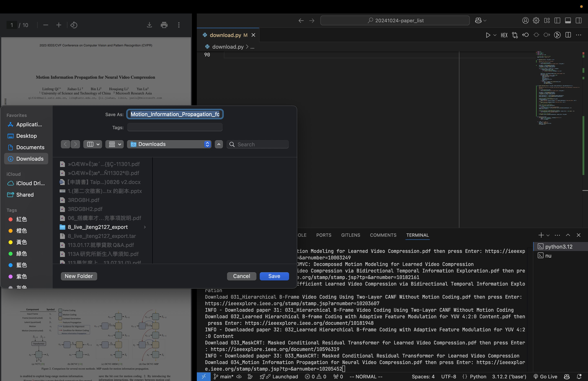

## Usage

1. Copy `.env.example` to `.env` and fill in the necessary information.
1. Add the `credentials.json` file to the root of the project, which can be obtained from the Google Cloud Console for accessing the Google Sheets API.
2. Connect to VPN for accessing IEEE Xplore full-text articles.
3. Run `python main.py` with skip IEEE to start downloading the pdfs that can be directly accessed.
4. Run `python main.py` without skip IEEE to download the pdfs from IEEE Xplore manually, and the script will automatically move the downloaded pdfs to the correct folder. You will need to specify where the pdfs are manually downloaded to.



## Dependencies (not complete)

```
pip install google-api-python-client google-auth-httplib2 google-auth-oauthlib
```